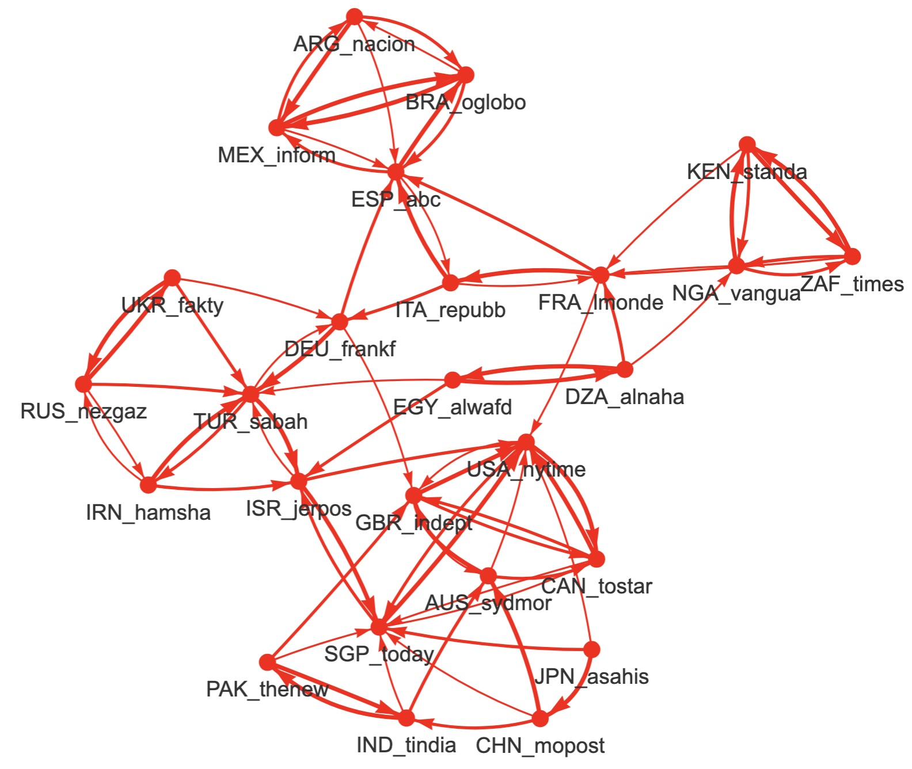

```{r}
library(data.table)
library(dplyr)
library(ggplot2)
library(knitr)
library(FactoMineR)
library(sf, quietly = T)
library(DT)
library(mapsf)
#library(mapsf, quietly = T)
#library(visNetwork, quietly=T)
```

## Research question

Which countries are the most mentionned in the news ? What are the variations according to media or time period ?How to aggregate the data from different sources.


## Data preparation

### Load media

We load the hypercube of each of the media of the database. Then we keep only the countries or territories that fit with the map.  

```{r}
# Check media list
listmedia <- list.files("sirius")
k<-length(listmedia)

# Load first media
media<-listmedia[1]
hc<-readRDS(paste0("sirius/",media,"/hc_int.RDS"))

# Load other media
for (i in 2:k) {
  media<-listmedia[i]
  hc2<-readRDS(paste0("sirius/",media,"/hc_int.RDS"))
  hc<-rbind(hc,hc2)
}
rm(hc2)
class(hc)


# Filter carto
map<-readRDS("geom/world_riate.RDS")


# Extract name and code
codename<-map %>% st_drop_geometry() %>% select(ISO3, NAMEen)
mystates<-names(table(map$ISO3))


# Correct minor bugs

## Correct code of Romania
#hc$where1[hc$where1=="ROM"] <-"ROU"
#hc$where1[hc$where2=="ROM"] <-"ROU"

## Eliminate small dependant units
smalldep <- c("PRI","MTQ","REU","GUF","GLP","NCL", "JEY", "FLK","FRO","GGY")


hc <- hc %>% filter(where1 %in% mystates, 
                    where2 %in% mystates,
                    !where1 %in% smalldep,
                    !where2 %in% smalldep) 


#filter time period

hc <- hc %>% filter(hc$when < as.Date("2020-01-01"))

saveRDS(hc, "data/hc.RDS")


```

### Matrix of salience by host countries

Finally we standardize in order to obtain a salience of frequency per 10,000 news. 

```{r}
# Agregate
tab<-hc[,.(  Fij=sum(tags)),
        .(i=who,j=where1)]

# Transform in matrix
tab2<-dcast(tab, formula = (j~i),fill = 0)
#write.table(tab2,"coverage.csv",row.names = F, sep=";")
mat<-as.matrix(tab2[,-1])
row.names(mat)<-tab2$j

# Put host-guest cells to 0

n<-dim(mat)[1]
p<-dim(mat)[2]
rowN<-row.names(mat)
colN<-substr(colnames(mat),1,3)
for (i in 1:n) {
  for (j in 1:p) {
    
    if (rowN[i]==colN[j]) {mat[i,j]<-0}
  }
}


## Compute value p. 100000

t<-apply(mat,2,sum,na.rm=T)
mat <- round(100000*prop.table(mat,2))


# Put host-guest cells to 0

n<-dim(mat)[1]
p<-dim(mat)[2]
rowN<-row.names(mat)
colN<-substr(colnames(mat),1,3)
for (i in 1:n) {
  for (j in 1:p) {
    
    if (rowN[i]==colN[j]) {mat[i,j]<-NA}
  }
}

# Transform in dataframe
tab<-as.data.frame(mat)
nc<-dim(tab)[2]
tab$ISO3 <- substr(rownames(mat),1,3)


# Add name


tab <- tab %>% left_join(codename)
tab<-tab[,c(nc+1,nc+2,1:nc)]


kable(tab,caption = "Salience of countries by media (p. 100,000)")
```

### Compute parameters

```{r}
## Add parameters
tab$mean <- apply(mat,1,mean, na.rm=T)
tab$rnk<-rank(-tab$mean)
tab$sd<-apply(mat,1,sd,na.rm=T)
tab$min <- apply(mat, 1,min, na.rm=T)
tab$Q1 <- apply(mat, 1, quantile, 0.25, na.rm=T)
tab$Q2 <- apply(mat,1,median, na.rm=T)
tab$Q3 <- apply(mat, 1, quantile, 0.75, na.rm=T)
tab$max<-apply(mat,1,max,na.rm=T)
tab$nbsup0 <- apply(mat>0,1,sum,na.rm=T)
tab$nbsup10 <- apply(mat>10,1,sum,na.rm=T)
tab$nbsup100 <- apply(mat>100,1,sum,na.rm=T)


param<-tab %>% arrange(-Q2) %>% select(rnk,ISO3,NAMEen,min,Q1,Q2,Q3,mean,sd)


kable(param, digits = 0,row.names = F, caption = "Salience of countries (p. 100,000)")

```

### Map of average salience

```{r}


grat<-readRDS("geom/WORLD30.RDS")
wld <- st_transform(map, st_crs(grat))
wld<-wld %>% inner_join(tab)


#saveRDS(wld,"geom/sirius.RDS")
#st_write(wld,"geom/sirius.geojson",delete_dsn = T)
#st_write(grat,"geom/grat30.geojson",delete_dsn = T)


wld<-wld%>% mutate(sal = mean/1000)

mf_map(grat, type="base", lty=3,col="gray95")
mf_map(wld, type = "base",add=T, col="white")
mf_map(wld, type="prop", var="sal",
       col="red", alpha=0.3, inches=0.4,
       leg_title = "Salience (%)",
       leg_val_rnd = 1)
mf_layout("Map of average salience of countries (2013-2020)",
          credits = "(c) Grasland C., 2026 - Source : MediaCloud database",
          frame=T,
          arrow=F, 
          scale=F)


```

### Dorling cartogram

```{r}
library(cartogram)
cart<-cartogram_dorling(x=wld,weight="sal",k = 1)

mf_map(grat, type="base", lty=3,col="gray90")
mf_map(wld, type = "base",add=T, col="white", borde=NA)
mf_map(cart, type="base",col="red", add=T, border="white", lwd=0.4)
mf_layout("Dorling cartogram of average salience of countries (2013-2020)",
          credits = "(c) Grasland C., 2026 - Source : MediaCloud",
          frame=T,
          arrow=F, 
          scale=F)
```


## Typology of media profiles


### Correlation matrix

We establish a correlation matrix based on the Spearman correlation coefficient based on rank. The rank correlation has been chosen against the classical Pearson coefficient because it is less influenced by the weight of top countries (USA, China, Russia, ...) and is more likely to reval regional organisation of news at world scale. 

The correlation are based after exclusion of the host countries (where media are located) . For example, the correlation between *Le Monde* and *Times of India* will exclude the salience of France and India from the vectors of values used for the measure of correlation. 

```{r}
ncx<-nc+2
#mat2 <- tab[tab$nbsup10>5,3:ncx]
mat2 <- tab[tab$Q2>10,3:ncx]

# Correlation matrix (pearson)
#cor1 <- cor(mat2,use = "pairwise.complete.obs")
```


```{r}
# Correlation matrux (Spearman)
cor2 <- cor(mat2,use = "pairwise.complete.obs", method="spearman")


kable(cor2, digits=2, caption = "Spearman correlation coefficient between median values")
```


```{r}
```


### Principal Component Analysis

The PCA provide a first viusalization of the proximity between media and some clustrs can be easily observed on the plan defined by the two first component. It is a simple approximation and better results could be obtained with Multi Dimensional Scaling (MDS) or Network Analysis (it will be done later).

```{r}

#library(explor)
acp<-PCA(cor2, graph=F, ncp=10)
#explor(acp)
res <- explor::prepare_results(acp)
explor::PCA_ind_plot(res, xax = 1, yax = 2, ind_sup = FALSE, lab_var = "Lab",
    ind_lab_min_contrib = 0, col_var = NULL, labels_size = 9, point_opacity = 0.5,
    opacity_var = NULL, point_size = 64, ellipses = FALSE, transitions = TRUE,
  labels_positions = "auto", xlim = c(-10, 6), ylim = c(-8, 6))

```

- **Comment** : The figure reveals immediately a clustering of media based on geographical or language proximity. Notice the specific situation of the french media *Le Monde* in an intermediate position between media from Western Europe and media from Northern Africa. 


### Hierarchical Cluster Analysis

The hierarchical cluster analysis is realized on the matrix of dissimilarity between $D$ defined as the difference between 1 and the Spearman correlation coefficient : 

$D_{ij} = 1 - \rho_{ij}$

We can then apply different clustering methods. We have chosen here the classical method of Ward. 

```{r}
mydis<-1-cor2
mydis<-as.dist(mydis)
cah_euc <- hclust(mydis, method = "ward.D")


plot(cah_euc,
     hang = -1,
     check = T,
     cex.main = 1.2,
     main = "HCPC of media",
     ylab = "Dissimilarity",
     sub = NA,
     xlab = "")
```

- **Comment : ** The tree reveals a first partition in three main groups A, B and C, followed by a subdivision in 7 subgroups. The group A characterized media from Subsaharan Africa (A.1)  and North Africa & Arabia  (A.2). The group B is associated only to coutries located in Latin America .
Finally, the group C is divided in four subgroups corresponding  to Black Sea region (B.1),  Asia-Pacifica (B.2), Northern America and the U.K (B.3) and Western Europe (B.4).

## Network analysis

We start by computing for each media what are the three media with highest correlation that we consider as the most similar in terms of mdia coverage. We use the 4 main correlations between one media and the other to elaborate the network

```{r}
link<- reshape2::melt(cor2)
names(link)<-c("i","j","Rij")
int <- link %>% filter(Rij <0.9998) %>% group_by(i) %>%
          mutate(rnk =rank(-Rij)) %>%
          filter(rnk <4) %>% arrange(i,rnk)
    #      filter(Rij > 0.90)
```


```{r, eval=F}
library(visNetwork)
nodes<-data.frame(code = unique(c(int$i,int$j)))
nodes$code<-as.character(nodes$code)
nodes$id<-1:length(nodes$code)
nodes$label<-nodes$code
nodes$color <-"red"
nodes$color[nodes$code %in% int$j]<-"red"


# Adjust edge codes

int$size<-4-int$rnk
edges <- int %>% mutate(width = 1+5*size / max(size, na.rm=T)) %>%
                left_join(nodes %>% select(i=code, from = id)) %>%  
                left_join(nodes %>% select(j=code, to = id )) 

# compute nodesize
#toti<-int %>% group_by(i) %>% summarize(size =sum(size)) %>% select (code=i,size)
tot<-int %>% group_by(j) %>% summarize(size =sum(size)) %>% select (code=j,size)
tot$size[is.na(tot$size)]<-0
#tot<-rbind(toti,totj)
#tot<-unique(tot)
tot$code<-as.factor(tot$code)
nodes <- left_join(nodes,tot) 
nodes$size[is.na(nodes$size)]<-0
nodes$value=4
#nodes$value = 1 +5*sqrt(nodes$size/max(nodes$size,na.rm=T))


#sel_nodes <-nodes %>% filter(code %in% unique(c(sel_edges$i,sel_edges$j)))

# eliminate loops

#if(loops == FALSE) {edges <- edges[edges$from < edges$to,]}

net<- visNetwork(nodes, 
                  edges, 
                  main = "Network",
height = "1000px", 
                  width = "70%")   %>%   
   visNodes(scaling =list(min =2, max=20, 
                          label=list(min=20,max=40, 
                                    maxVisible = 20)))%>%
  visEdges(scaling = list(min=20,max=60),
           arrows = 'to',)%>%
       visOptions(highlightNearest = TRUE,
     #               selectedBy = "group", 
    #               manipulation = TRUE,
                  nodesIdSelection = TRUE) %>%
        visInteraction(navigationButtons = TRUE) %>%
         visLegend() %>%
      visIgraphLayout(layout ="layout.fruchterman.reingold",smooth = TRUE)

net
```




- **Comment** : The network analysis provide a more complete view of the proximity between newspapers than the clustering method. We recognize some strong clusters previously identified between arab countries, subsaharan Africa, eastern Europe and Middle East and the largest one between english speaking newspaer from northern America, Europe  and Asia. But we can also better appreciate the specific situation of some media that appears isolated (specific) because they are never present in the list of top correlations of the other newspapers. It is the case for Le Monde (France),la Repubblica (Italy), Republica (Indonesia) or Asahi Shimbum (Japan). This media plays an interesting role of bridge between clusters that would be otherwise not connected. This function of betweeness is also insure by other media that are strongly associated to their cluster but related to the rest by weak ties. For example the Spanish newspaper ABC is connected to the english grouo vie The NYT. The algerian newspaper Alnahar is connected with the nigerian newspaper Vanguardia, etc... 


## Country clusters

```{r}
ncx<-nc+2
#mat2 <- tab[tab$nbsup10>5,3:ncx]
mat3 <- tab[tab$Q2>1,3:ncx]
rownames(mat3)<-tab[tab$Q2>1,1]

# Correlation matrux (Spearman)
mat3<-t(mat3)
mat3[1:3,1:3]
cor3 <- cor(mat3,use = "pairwise.complete.obs", method="pearson",)
cor3[1:3,1:3]

#kable(cor3, digits=2, caption = "Spearman correlation coefficient between median values")
```


```{r}

#library(explor)
acp2<-PCA(cor3, graph=F,ncp = 10)
#explor(acp2)
#res <- explor::prepare_results(acp2)


```


### Hierarchical Cluster Analysis

The hierarchical cluster analysis is realized on the matrix of dissimilarity between $D$ defined as the difference between 1 and the Spearman correlation coefficient : 

$D_{ij} = 1 - \rho_{ij}$

We can then apply different clustering methods. We have chosen here the classical method of Ward. 

```{r}
mydis2<-1-cor3

cah_euc2 <- HCPC(acp2,nb.clust = 6,method = "ward",graph = F)

plot(cah_euc2,choice = "tree",title = "Hierarchical clustering of media")


```


```{r}
x<-cah_euc2$data.clust
clas <-data.frame(ISO3=rownames(x), myclus=x$clust )
clas$myclus<-as.factor(clas$myclus)
levels(clas$myclus) <- c("1. Western Europe",
                         "2. Eastern Europe",
                         "3. Latin America",
                         "4. Middle East & North Africa",
                         "5. Anglo-Pacifica",
                         "6. Subsaharan Africa"
                         )

wld2<-left_join(wld,clas)

mf_map(wld2, 
       type="typo",
       var="myclus", 
       leg_title = "WORLD REGIONS", 
       pal=rainbow(9))
mf_layout(title = "World regions according to media coverage (2013-2020)",
          credits= "The Sirius Project (2026)",
          scale = F, 
          arrow=F,
          frame = T)
```

