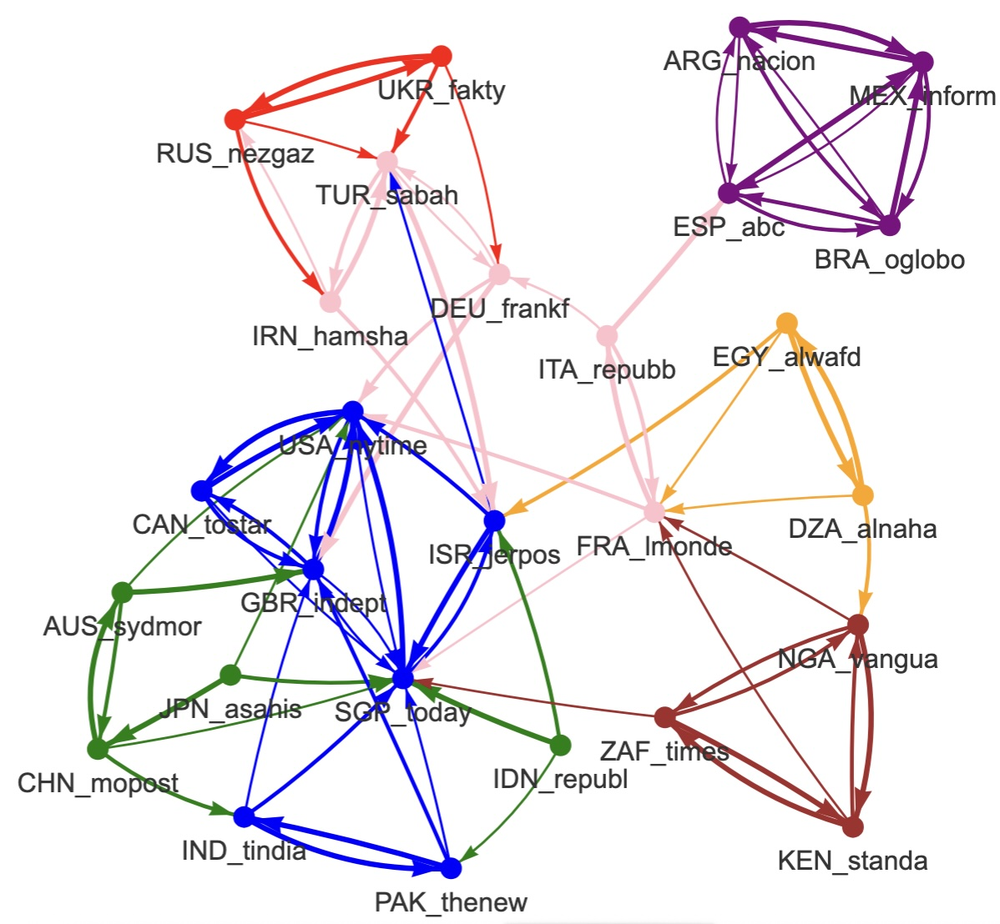

```{r}
library(data.table)
library(dplyr)
library(ggplot2)
library(ggrepel)
library(knitr)
library(FactoMineR)
library(sf, quietly = T)
library(DT)
library(mapsf)
library(gridExtra)
#library(mapsf, quietly = T)
#library(visNetwork, quietly=T)
```

## Research question

- RQ1 : Which countries are the most mentionned in the news ? What are the variations according to media or time period ?How to aggregate the data from different sources.
- RQ2 : What is the similarity between media playing the role of guest ? Is it based on distance or regiobal clusters.
- RQ3 : What is the similarity between host countries described by various media ? Is it based on distance or regiobal clusters.
- RQ4 : Can we find a correspondance between the location of guest countries and media ?


## (A) Data preparation

### Load media

We load the hypercube of each of the media of the database. Then we keep only the countries or territories that fit with the map.  

```{r}
# Check media list
listmedia <- list.files("sirius")
k<-length(listmedia)


# Load first media
media<-listmedia[1]
hc<-readRDS(paste0("sirius/",media,"/hc_int.RDS"))

# Load other media
for (i in 2:k) {
  media<-listmedia[i]
  hc2<-readRDS(paste0("sirius/",media,"/hc_int.RDS"))
  hc<-rbind(hc,hc2)
}
rm(hc2)


# Filter carto
map<-readRDS("geom/world_riate.RDS")


# Extract name and code
codename<-map %>% st_drop_geometry() %>% select(ISO3, NAMEen)
mystates<-names(table(map$ISO3))


# Correct minor bugs

## Correct code of Romania
#hc$where1[hc$where1=="ROM"] <-"ROU"
#hc$where1[hc$where2=="ROM"] <-"ROU"

## Eliminate small dependant units or ambiguity (Congo)
smalldep <- c("PRI","MTQ","REU","GUF","GLP","NCL", "JEY", "FLK","FRO","GGY",
              "GRD","KIR","KNA","LCA","MHL","SMR","STP","VCT","DMA","ATG","TUV","FSM","COG","DOM")


hc <- hc %>% filter(where1 %in% mystates, 
                    where2 %in% mystates,
                    !where1 %in% smalldep,
                    !where2 %in% smalldep) 


#filter time period

hc <- hc %>% filter(hc$when < as.Date("2020-07-01"))

#saveRDS(hc, "data/hc.RDS")


```

### Matrix crossing host media and guest countries

Finally we standardize in order to obtain a salience of frequency per 100,000 news. 

```{r}
# Agregate
tab<-hc[,.(  Fij=sum(news)),
        .(i=who,j=where1)]

# Transform in matrix
tab2<-dcast(tab, formula = (j~i),fill = 0)
#write.table(tab2,"coverage.csv",row.names = F, sep=";")
mat<-as.matrix(tab2[,-1])
row.names(mat)<-tab2$j

# Put host-guest cells to 0

n<-dim(mat)[1]
p<-dim(mat)[2]
rowN<-row.names(mat)
colN<-substr(colnames(mat),1,3)
for (i in 1:n) {
  for (j in 1:p) {
    
    if (rowN[i]==colN[j]) {mat[i,j]<-0}
  }
}


## Compute value p. 100000

t<-apply(mat,2,sum,na.rm=T)
mat <- round(100000*prop.table(mat,2))


# Put host-guest cells to 0

n<-dim(mat)[1]
p<-dim(mat)[2]
rowN<-row.names(mat)
colN<-substr(colnames(mat),1,3)
for (i in 1:n) {
  for (j in 1:p) {
    
    if (rowN[i]==colN[j]) {mat[i,j]<-NA}
  }
}

# Transform in dataframe
tab<-as.data.frame(mat)
nc<-dim(tab)[2]
tab$ISO3 <- substr(rownames(mat),1,3)


# Add name


tab <- tab %>% left_join(codename)
tab<-tab[,c(nc+1,nc+2,1:nc)]


#kable(tab[1:10,1:5],caption = "Extract of the interaction matrix")

# Matrix
mat<-as.matrix(tab[,-c(1:2)])
rownames(mat)<-paste(tab$ISO3,tab$NAMEen, sep="_")


# Correct sum with usa
mat2<-mat
x<-mat2["USA_United States of America",]
y<-apply(mat,2,sum, na.rm=T)-100000

mat2["USA_United States of America",]<-x-y
#apply(mat2,2,sum, na.rm=T)
mat2["CHN_China","USA_nytime"]<-mat2["CHN_China","USA_nytime"]-2
mat<-mat2
# Save matrix
saveRDS(mat, "data/interaction.RDS")

```


### Discussion

We obtain a complete matrix where all cells are filled except the ones where the host media is located in the guest country. The weight of all media is made equal to a total sum of 10000 news.

```{r}
kable(mat[1:10,1:5], caption="Matrix of interaction between host media and guest countries (p.100,000)",)
```

- **Comment** : 
  +   Lecture in column : over the period of observation, the proportion of foreign news published by La Nacion about Australia is equal to 1492/100,000 or 1.49 % . It is much more than the news about Afghanistan which is 157/10000 or 0.16% The number of news published by this media about Argentina is not available as the location of the host media is Argentina and the news is not a foreign one. 
  + lecture in line : Argentina is more likely to be present in the news published by the Brazilian media O Globo frm Brazil (3.93%) than in the news published by the Toronto Star from Canada (0.29%)


## (B) TOP COUNTRIES

We propose here to identify the top countries in the sample of media that we have selected.


### Compute parameters

```{r}
mat<-readRDS("data/interaction.RDS")

## Add parameters
tab<-data.frame(ISO3=substr(rownames(mat),1,3), NAME = substr(rownames(mat),5,200))
tab$mean <- apply(mat,1,mean, na.rm=T)

tab$sd<-apply(mat,1,sd,na.rm=T)
tab$min <- apply(mat, 1,min, na.rm=T)
tab$Q1 <- apply(mat, 1, quantile, 0.25, na.rm=T)
tab$Q2 <- apply(mat,1,median, na.rm=T)
tab$Q3 <- apply(mat, 1, quantile, 0.75, na.rm=T)
tab$max<-apply(mat,1,max,na.rm=T)
tab$nbsup0 <- apply(mat>0,1,sum,na.rm=T)
tab$nbsup10 <- apply(mat>10,1,sum,na.rm=T)
tab$nbsup100 <- apply(mat>100,1,sum,na.rm=T)
tab$IQR<-(tab$Q3-tab$Q1)/tab$Q2
tab$rnk<-rank(-tab$Q2)


param<-tab %>% arrange(-Q2) %>% select(rnk,ISO3,NAME,Q2,IQR,mean,sd,min,Q1,Q3,max)


kable(head(param,25), digits = c(0,0,0,0,2,0,0,0,0,0,0),
      row.names = F, caption = "Median salience of countries (p. 10,000)",
      col.names = c("Rank","Code","Name","Salience (Q2)", "Variability (IQR/Q2)", "Mean","st. dev.","min", "Q1", "Q3", "max")
      )

```


### Size and variability

```{r}
ggplot(tab)+aes(x=Q2, y=IQR, label=ISO3) + 
  geom_point() + 
  geom_text_repel(size=3) +
  geom_smooth(method = "lm",col="black")+
  scale_x_log10("Median salience (p. 100,000)")+
  scale_y_log10("Variability of coverage (Q3-Q1)/Q2")+
  theme_light() +
  ggtitle(label = "Relation between median  salience and variability of coverage of countries by press",subtitle = "Source : Foreign news published by 25 media outlets from june 2013 to june 2020")

cor.test(log(tab$Q2),log(tab$IQR))
cor.test(log(tab$Q2),log(tab$IQR), method="spearman")

```


- **Comment** : This figure confirm an hypothesis previously formulated by Segev about 'visible' and 'invisible' countries which is the fact that the variability of media coverage is inversely proportional to the global salience of countries. The relation is noy linear but follows a power law (r= -0.70, p< 0.001). A country like the US is characterized by the highest level of salience (median = 15%) and one of the lowest coefficient of variability (IQR = 0.52). At the opposite, Chad is characterized by a vry low level of salience (0.1%) but a very high variability of coverage in the different media (3.20). They are of course residuals and some country with the same level of salience cand be characterised by very different levels of variability. For example, the Netherlands are the country characterized by the most homogeneous level of coverage (mean = 0.7%, IQR = 0.38). But Palestinian territories with a similar level of salience (mean = 0.7%) are characterized by a much stronger variability (IQR = 1.15). It means that the flow of foreign news concerning the Netherlands is relatively equivalent for the different media but they are much more differences in the case of the coverage of the Yemen. 

### Map of average salience

We use a polar projection

```{r}


grat<-readRDS("geom/WORLD30.RDS")
map<-st_transform(map, st_crs(grat))
wld <- map
wld<-wld %>% inner_join(param)

sir<-readRDS("geom/sirius.RDS")
sir <- st_transform(sir, st_crs(grat))
#saveRDS(wld,"geom/sirius.RDS")
#st_write(wld,"geom/sirius.geojson",delete_dsn = T)
#st_write(grat,"geom/grat30.geojson",delete_dsn = T)


wld<-wld%>% mutate(sal = Q2/1000)

mf_map(grat, type="base", lty=3,col="white")
mf_map(wld, type = "base",add=T, col="white")
mf_map(wld, type="prop", var="sal",
       col="black", alpha=0.5, inches=0.4,
       leg_title = "Median salience (% of news)",
       leg_val_rnd = 1)
mf_map(sir,type = "prop", pch=24, add=T, col="red", cex=0.7,symbol = "square",
       var = "news",inches = 0.03,
       leg_title = "Location of host media",
       leg_pos = "topright")
mf_layout("Map of median salience of guest countries (2013-2020)",
          credits = "Source : Foreign news published by 25 media outlets from june 2013 to june 2020",
          frame=T,
          arrow=F, 
          scale=F)


```

### Dorling cartogram

```{r}
library(cartogram)
cart<-cartogram_dorling(x=wld,weight="Q2",k = 1)

mf_map(grat, type="base", lty=3,col="gray90")
mf_map(wld, type = "base",add=T, col="white", borde="white")
mf_map(cart, type="base",col="gray20", add=T, border="white", lwd=0.4)
mf_layout("Dorling cartogram of median salience of guest countries (2013-2020)",
          credits = "Source : Foreign news published by 25 media outlets from june 2013 to june 2020",
          frame=T,
          arrow=F, 
          scale=F)
```


## (C) CORRELATION ANALYSIS 1 : HOST MEDIA


```{r}
mat<-readRDS("data/interaction.RDS")
```

### Correlation matrix

We establish a correlation matrix based on the Spearman correlation coefficient based on rank. The rank correlation has been chosen against the classical Pearson coefficient because it is less influenced by the weight of top countries (USA, China, Russia, ...) and is more likely to reval regional organisation of news at world scale. 

The correlation are based after exclusion of the host countries (where media are located) . For example, the correlation between *Le Monde* and *Times of India* will exclude the salience of France and India from the vectors of values used for the measure of correlation. 


```{r}
# Correlation matrux (Spearman)
cor2 <- cor(mat,use = "pairwise.complete.obs", method="spearman")


kable(cor2[1:5,1:5], digits=3, caption = "Spearman correlation coefficient between median values")
```

- **Comment** : The media *La Nacion* from Argentina is much more correlated with the brasilian newspaper *O Globo* ($\rho = + 0.87$) than with the *Sydney Morning Herald* ($\rho = + 0.65$) or the *South China Morning Post* ($\rho = + 0.62$). Reversely the  *Sydney Morning Herald*  is much more correlated with the *South China Morning Post* ($\rho = + 0.87$) than with *O Globo* ($\rho = + 0.73$). This example suggest the existence of a latent structure likely to reveal clusters of country characterized by higher levels of correlation. 


### Example

```{r}
media1<-"ZAF_times"
media2 <- "MEX_inform"
country1 <- substr(media1,1,3)
country2 <- substr(media2,1,3)
ex<-mat[,c(media1,media2)] %>% as.data.frame()
ex$code<-substr(row.names(ex),1,3) 
names(ex)<-c("x1","x2","code")
ex <- ex %>% filter(! code %in% c(country1,country2))
ex$rnk1<-rank(-ex$x1)
ex$rnk2<-rank(-ex$x2)
cor1<-cor(ex$x1,ex$x2)
cor2<-cor(ex$x1,ex$x2, method="spearman")

plot1<-ggplot(ex) +aes(x=x1,y=x2, label=code) + geom_point()+geom_text_repel() + ggtitle(paste("Pearson correlation = ",round(cor1,2)," ***"))
plot2<-ggplot(ex) +aes(x=rnk1,y=rnk2, label=code) + geom_point()+geom_text_repel()+scale_x_reverse()+scale_y_reverse() +ggtitle(paste("Spearman correlation = ",round(cor2,2)," ***"))

grid.arrange(plot1, plot2, ncol=2)
```


### Principal Component Analysis

The PCA provide a first viusalization of the proximity between media and some clustrs can be easily observed on the plan defined by the two first component. It is a simple approximation and better results could be obtained with Multi Dimensional Scaling (MDS) or Network Analysis (it will be done later).

```{r}

#library(explor)
acp<-PCA(cor2, graph=F, ncp=20)
#explor(acp)
res <- explor::prepare_results(acp)
explor::PCA_ind_plot(res, xax = 1, yax = 2, ind_sup = FALSE, lab_var = "Lab",
    ind_lab_min_contrib = 0, col_var = NULL, labels_size = 9, point_opacity = 0.5,
    opacity_var = NULL, point_size = 64, ellipses = FALSE, transitions = TRUE,
  labels_positions = "auto", xlim = c(-10, 6), ylim = c(-8, 6))

```

- **Comment** : The figure reveals immediately a clustering of media based on geographical or language proximity. Notice the specific situation of the french media *Le Monde* in an intermediate position between media from Western Europe and media from Northern Africa. 


### Hierarchical Cluster Analysis

The hierarchical cluster analysis is realized on the components of the previous PCA.


```{r}

cah_sta <- HCPC(acp,nb.clust = 7,graph = F)

plot(cah_sta,choice = "tree")

```

- **Comment : ** The analysis of the inertia of the tree suggest a partition in  3 groups and 7 subgroups. Group A is the most original and reveals the specificity of host media located in northern Africa (A.1) and subsaharan Africa (A.2). This strong break in the tree suggest the existence of a mediatic region of Africa, related to a specific arena of news covering this continent. The group B is mainly associated to rich countries of the Global North but with interesting exceptions. The subgroup B.1 is only associated to media of english speaking countries historically associated to UK or the US (Canada, India, Pakistan, Singapore, Canada, Israel). The subgroup B.2 associates media located in three major european countries (Italy, France, Germany) with two media located in Turkey and Iran. The group C is globally more heterogenous but the different subgroups located inside are more coherent. the subgroup C.1 associates Russia and Ukraine. The subgroup C.2 associates media located countries from the Asia-Pacifica region. The subgroup C.3 associates three media located in Latin America and a media from Spain which suggest an effect of language or colonial inheritage. 

But the clustering approach introduce barriers in a reality which is in practice more complex. And we prefer to complete the analysis by a network approach where we have represented for each media outlet the links with three media having the highest level of correlation. 


### Network analysis

We start by computing for each media what are the three media with highest correlation that we consider as the most similar in terms of mdia coverage. We use the 4 main correlations between one media and the other to elaborate the network

```{r}
link<- reshape2::melt(cor2)
names(link)<-c("i","j","Rij")
int <- link %>% filter(Rij <0.9998) %>% group_by(i) %>%
          mutate(rnk =rank(-Rij)) %>%
          filter(rnk <4) %>% arrange(i,rnk)
    #      filter(Rij > 0.90)
```


```{r, eval=F}
library(visNetwork)
nodes<-data.frame(code = unique(c(int$i,int$j)))
nodes$code<-as.character(nodes$code)
nodes$id<-1:length(nodes$code)
nodes$label<-nodes$code
nodes$type <-as.factor(cah_sta$data.clust$clust)
nodes$label
nodes$type
levels(nodes$type)
levels(nodes$type)<-c("A.1 : Subsaharan Africa",
                      "A.2 : Northern Africa",
                      "C.1 : Former Soviet Union",
                      "C.2 : Asia-Pacifica",
                      "C.3 : Latin America & Spain",
                      "B.2 : Western Europe & Middle East",
                      "B.1 : Anglo-american world")
nodes$type<-as.factor(as.character(nodes$type))
nodes$color <-nodes$type
levels(nodes$color) <-c("orange","yellow", "red","pink","lightblue","blue","green")
#levels(nodes$color) <-rainbow(7)
#nodes$color[nodes$code %in% int$j]<-"red"


# Adjust edge codes

int$size<-4-int$rnk
edges <- int %>% mutate(width = 1+5*size / max(size, na.rm=T)) %>%
                left_join(nodes %>% select(i=code, from = id)) %>%  
                left_join(nodes %>% select(j=code, to = id )) 

# compute nodesize
#toti<-int %>% group_by(i) %>% summarize(size =sum(size)) %>% select (code=i,size)
tot<-int %>% group_by(j) %>% summarize(size =sum(size)) %>% select (code=j,size)
tot$size[is.na(tot$size)]<-0
#tot<-rbind(toti,totj)
#tot<-unique(tot)
tot$code<-as.factor(tot$code)
nodes <- left_join(nodes,tot) 
nodes$size[is.na(nodes$size)]<-0
nodes$value=4
#nodes$value = 1 +5*sqrt(nodes$size/max(nodes$size,na.rm=T))


#sel_nodes <-nodes %>% filter(code %in% unique(c(sel_edges$i,sel_edges$j)))

# eliminate loops

#if(loops == FALSE) {edges <- edges[edges$from < edges$to,]}

net<- visNetwork(nodes, 
                  edges, 
                  main = "Network",
height = "1000px", 
                  width = "70%")   %>%   
   visNodes(scaling =list(min =2, max=20, 
                          label=list(min=20,max=40, 
                                    maxVisible = 20)))%>%
  visEdges(scaling = list(min=20,max=60),
           arrows = 'to',)%>%
       visOptions(highlightNearest = TRUE,
     #               selectedBy = "group", 
    #               manipulation = TRUE,
                  nodesIdSelection = TRUE) %>%
        visInteraction(navigationButtons = TRUE) %>%
         visLegend() %>%
      visIgraphLayout(layout ="layout.fruchterman.reingold",smooth = TRUE)

net


```




- **Comment** : The network analysis provide a more complete view of the proximity between newspapers than the clustering method. We recognize some strong clusters previously identified between arab countries, subsaharan Africa, eastern Europe and Middle East and the largest one between english speaking newspaer from northern America, Europe  and Asia. But we can also better appreciate the specific situation of some media that appears isolated (specific) because they are never present in the list of top correlations of the other newspapers. It is the case for Le Monde (France),la Repubblica (Italy), Republika (Indonesia) or Asahi Shimbum (Japan). This media plays an interesting role of bridge between clusters that would be otherwise not connected. This function of betweeness is also insure by other media that are strongly associated to their cluster but related to the rest by weak ties. For example the Spanish newspaper ABC is connected to the english grouo vie The NYT. The algerian newspaper Alnahar is connected with the nigerian newspaper Vanguardia, etc... 


## (D) CORRELATION ANALYSIS 2 : GUEST COUNTRIES

```{r}


# Correlation matrux (Spearman)
mat3<-t(mat)
mat3[1:3,1:3]
cor3 <- cor(mat3,use = "pairwise.complete.obs", method="pearson",)
colnames(cor3)<-substr(colnames(cor3),1,3)
rownames(cor3)<-substr(rownames(cor3),1,3)
sel<-c("NOR","DNK","FIN","COL","PER","CHL","LBN","JOR","SAU")
kable(cor3[sel,sel], digits=2, caption = "Pearson correlation coefficient between median values")
```


### Example

```{r}
mat4<-mat
row.names(mat4)<-substr(row.names(mat4),1,3)
place1<-"USA"
place2 <- "CHN"
ex<-data.frame(x1=mat4[place1,],x2=mat4[place2,])
ex$code<-colnames(mat4)
ex <- ex %>% filter(! substr(code,1,3) %in% c(place1,place2))
ex$rnk1<-rank(-ex$x1)
ex$rnk2<-rank(-ex$x2)
cor1<-cor(ex$x1,ex$x2)
cor2<-cor(ex$x1,ex$x2, method="spearman")

plot1<-ggplot(ex) +aes(x=x1,y=x2, label=code) + geom_point()+geom_text_repel() + ggtitle(paste("Pearson correlation = ",round(cor1,2)," ***"))
plot2<-ggplot(ex) +aes(x=rnk1,y=rnk2, label=code) + geom_point()+geom_text_repel()+scale_x_reverse()+scale_y_reverse() +ggtitle(paste("Spearman correlation = ",round(cor2,2)," ***"))

grid.arrange(plot1, plot2, ncol=2)
```


```{r}

#library(explor)
acp2<-PCA(cor3, graph=F,ncp = 30)
#explor(acp2)
#res <- explor::prepare_results(acp2)


```


### Hierarchical Cluster Analysis

The hierarchical cluster analysis is realized on the matrix of dissimilarity between $D$ defined as the difference between 1 and the Spearman correlation coefficient : 

$D_{ij} = 1 - \rho_{ij}$

We can then apply different clustering methods. We have chosen here the classical method of Ward. 

```{r}
mydis2<-1-cor3

cah_euc2 <- HCPC(acp2,nb.clust = 6,method = "ward",graph = F)

plot(cah_euc2,choice = "tree",title = "Hierarchical clustering of media")


```


```{r}
x<-cah_euc2$data.clust
clas <-data.frame(ISO3=rownames(x), myclus=x$clust )
clas$myclus<-as.factor(clas$myclus)
levels(clas$myclus) <- c("B.1 Eastern Europe",
                         "B.2 Western Europe",
                         "B.3 Latin America",
                         "A.1 Middle East & North Africa",
                         "C.  Anglo-Asia-Pacifica",
                         "A.2 Subsaharan Africa"
                         )
clas$myclus<-as.factor(as.character(clas$myclus))
mypal<-c("lightyellow","orange","red","pink","lightgreen", "lightblue")

wld2<-left_join(wld,clas)
mf_map(map, type="base", col="lightgray")
mf_map(wld2, 
       type="typo",
       var="myclus", 
       leg_title = "WORLD REGIONS", 
       add=T,
       pal=mypal)
mf_layout(title = "World regions according to media coverage (2013-2020)",
          credits= "The Sirius Project (2026)",
          scale = F, 
          arrow=F,
          frame = T)
```

