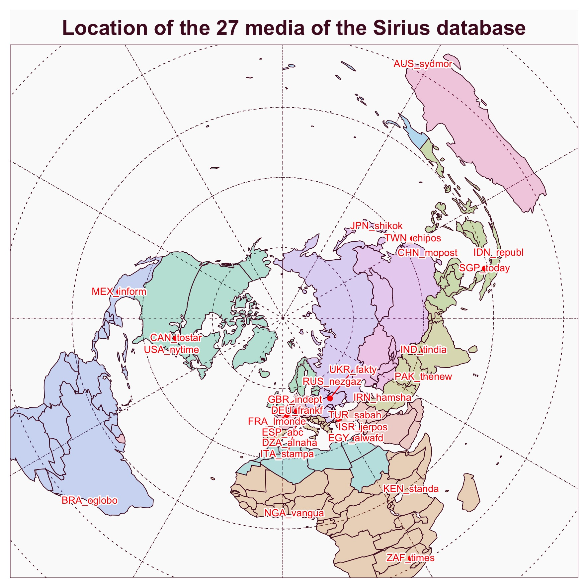
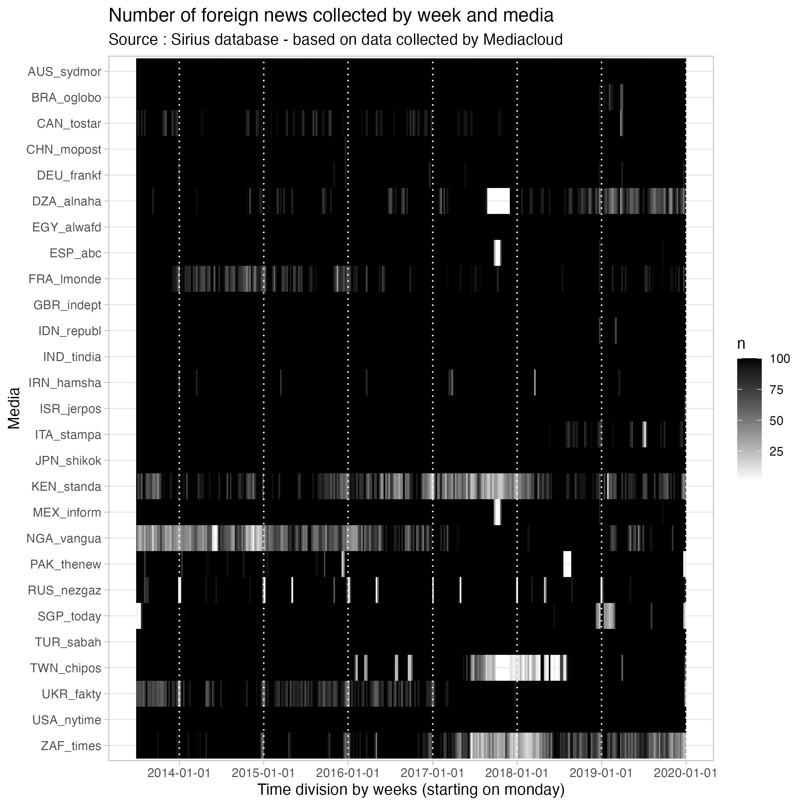
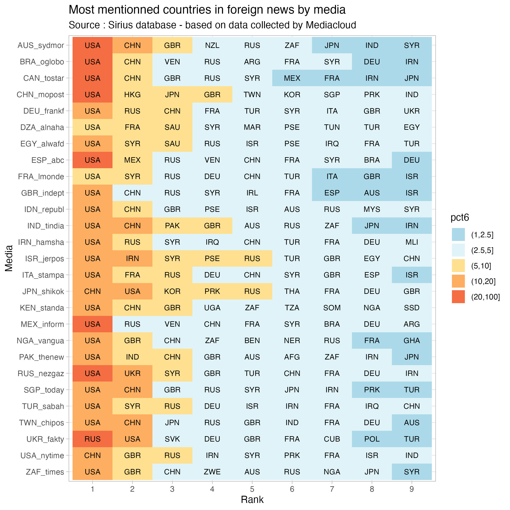

:::{#hero-heading}


:::


## Selection of 27 daily newspapers

We have selected a sample of 27 daily newspapers distributed in different locations all around the world and published in different languages. 

{width=600}
```{r, echo=F}
library(sf)
library(knitr,warn.conflicts = F)
library(dplyr,warn.conflicts = F)
tab <- readRDS("data/mapmedia.RDS") %>% st_drop_geometry() %>%
  select(1:5)
kable(tab)
```


## 100 foreign news by week from july 2013 to december 2020

We have extracted from each media a corpus of 100 foreign news per week during 365 weeks from July 2013 to December 2020. When the number of foreign news during a week was greater than 100, we proceeded to a random selection. In the majority of case, the objective was fullfiled with a total of 36500 news.

{width=600}

## Identification of most mentionned countries

We have firstly analysed the list of the 10 countries the most mentionned by each media (excluding the country where the media is located).

{width=600}
We observe without surprise that the US are generally mentionned in first place in the majority of media. But they are string variations when we look at the following ranks. And we can suspect that, out of the USA, we can identify various cluster of media with very different coverage of small and medium countries.

## Correlation between media coverage of international events

We have therefore calculated the rank correlation of the coverage of news by media over the period. By using the Spearman correlation based on rank, rather than the classical Bravais-Pearson correlation coefficient, we allocate more importance to the coverage of small and medium countries. We analyze the results through a correlation plot that indicates for each media the 5 other media which are the most similar.


{width=600}

As we can see, the network reveals the existence of strong clusters of media with internal similarities but differencies withthe other one. The world of media is therefore certainly not flat...

## The world seen from Sirius

The next step of our research will be to examine the distances between media or countries based on the intensity of their links of citation and co-citation in news. We expect to discover new geometries of the world, following the method descirbed by Waldo Tobler in its famous "Cappadocian Speculation". 
