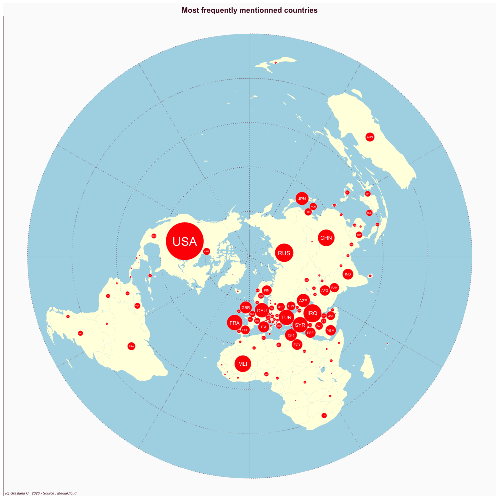

```{r, eval=F, echo=F}
library(data.table)
library(dplyr)
library(sf)
library(cartogram)
library(mapsf)
media<-"IRN_hamsha"
hc<-readRDS(paste0("../sirius/",media,"/hc_int.RDS")) %>%  filter(where1 !=substr(media,1,3))
nbnews<-sum(hc$news)
tab<-hc[,.(nb=sum(news)),.(ISO3=where1)] %>% 
         arrange(-nb) %>% 
        mutate(sal = 100*nb/nbnews)
map<-readRDS("../geom/world_riate.RDS")
grat<-st_read("../geom/grat30.geojson")
map<-st_transform(map,st_crs(grat))
wld<-left_join(map,tab)
wld2 <-wld %>% filter(is.na(sal)==F)

cart<-cartogram_dorling(x=wld2,weight="sal",k = 1)
png(paste0("img/",media,"_salience.png"),width = 1000, height=1000)
mf_map(grat, type="base", lty=3,col="lightblue")
mf_map(wld, type = "base",add=T, col="lightyellow", borde=NA)
mf_map(cart, type="base",col="red", add=T, border="white", lwd=0.4)
mf_label(cart, var = "ISO3",cex=2*sqrt(cart$sal/max(cart$sal)), col="white")
mf_layout("Most frequently mentionned countries",
          credits = "(c) Grasland C., 2026 - Source : MediaCloud",
          frame=T,
          arrow=F, 
          scale=F)
dev.off()


#### NETWORK

source("pgm_network.R")


hc<-hc %>% filter(where1 !=substr(who,1,3),
                  where2 !=substr(who,1,3))

hc<-hc_filter(don = hc,
              wgt = "tags",
              where1 = "where1",
              where2 = "where2",
              where1_exc = c("_no_"),
              where2_exc = c("_no_"),
              self = FALSE
)

int <- build_int(don = hc,
                 s1=2,
                 s2=2,
                 n1=1,
                 n2=1,
                 k=0)
int$Fij<-round(int$Fij)

mod<-rand_int(int,
              resid = TRUE,
              diag = FALSE)

network<- geo_network(mod,
                      size = "Fij",
                      minsize = 5,
                      test = "Rchi_ij",
                      mintest = 3.84)
network
myfile<-paste0("networks/",media,"_network.html")
saveRDS(network, myfile)
```



```{r, echo=F}
media<-"IRN_hamsha"
myfile<-paste0("networks/",media,"_network.html")
x<-readRDS(myfile)
x
```


::: {#profil}


::: {#pays}
<i class="bi bi-globe2"></i> \
:::
:::

- Website : [Hamshari](http://hamshahrionline.ir/)


## <i class="bi bi-ui-checks-grid"></i> Scale

::: {#liste}
-   Global
-   National

:::

## <i class="bi bi-person-video3"></i> Topics

<div>

-   General news
-   Political news
-   Economic news


</div>

## <i class="bi bi-file-earmark-text"></i> Publications

::: {#refs}
:::
