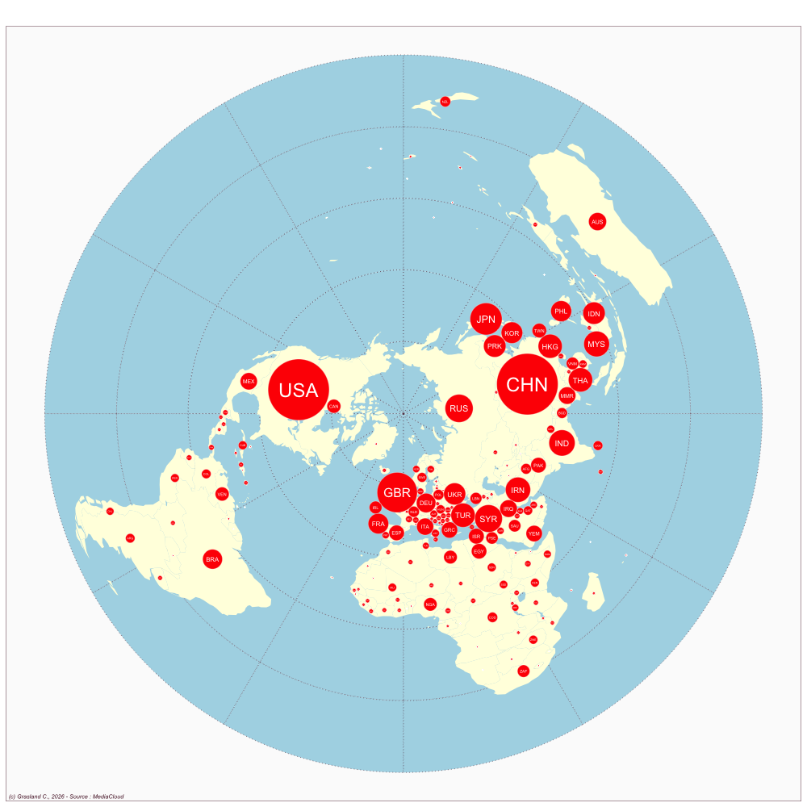

```{r, eval=F, echo=F}
library(data.table)
library(dplyr)
library(sf)
library(cartogram)
library(mapsf)
media<-"SGP_today"
hc<-readRDS(paste0("../sirius/",media,"/hc_int.RDS")) %>%  filter(where1 !=substr(media,1,3))
nbnews<-sum(hc$news)
tab<-hc[,.(nb=sum(news)),.(ISO3=where1)] %>% 
         arrange(-nb) %>% 
        mutate(sal = 100*nb/nbnews)
map<-readRDS("../geom/world_riate.RDS")
grat<-st_read("../geom/grat30.geojson")
map<-st_transform(map,st_crs(grat))
wld<-left_join(map,tab)
wld2 <-wld %>% filter(is.na(sal)==F)

cart<-cartogram_dorling(x=wld2,weight="sal",k = 1)
png("img/SGP_today_salience.png",width = 1000, height=1000)
mf_map(grat, type="base", lty=3,col="lightblue")
mf_map(wld, type = "base",add=T, col="lightyellow", borde=NA)
mf_map(cart, type="base",col="red", add=T, border="white", lwd=0.4)
mf_label(cart, var = "ISO3",cex=2*sqrt(cart$sal/max(cart$sal)), col="white")
mf_layout("",
          credits = "(c) Grasland C., 2026 - Source : MediaCloud",
          frame=T,
          arrow=F, 
          scale=F)
dev.off()
```




::: {#profil}


::: {#pays}
<i class="bi bi-globe2"></i> \
:::
:::

- Website : [Today (Singapore)](https://www.channelnewsasia.com/today)


## <i class="bi bi-ui-checks-grid"></i> Scale

::: {#liste}
-   Global
-   National

:::

## <i class="bi bi-person-video3"></i> Topics

<div>

-   General news
-   Political news
-   Economic news


</div>

## <i class="bi bi-file-earmark-text"></i> Publications

::: {#refs}
:::
