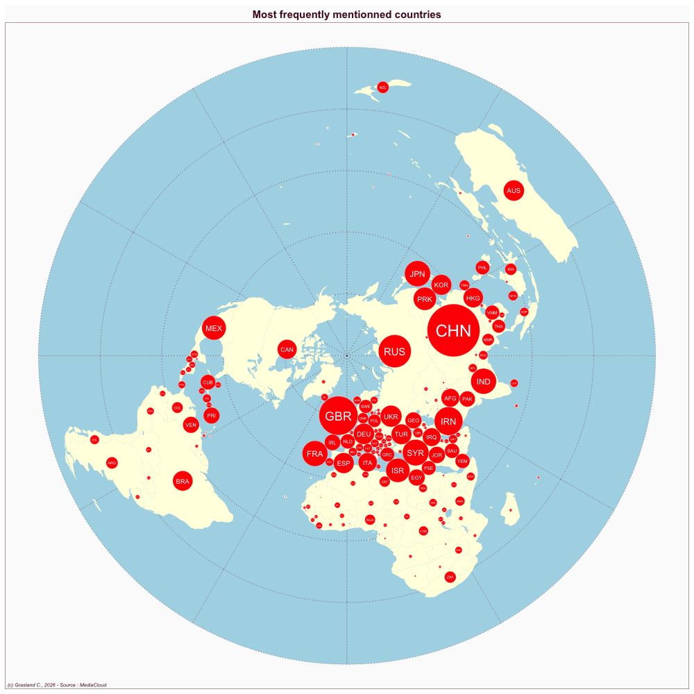
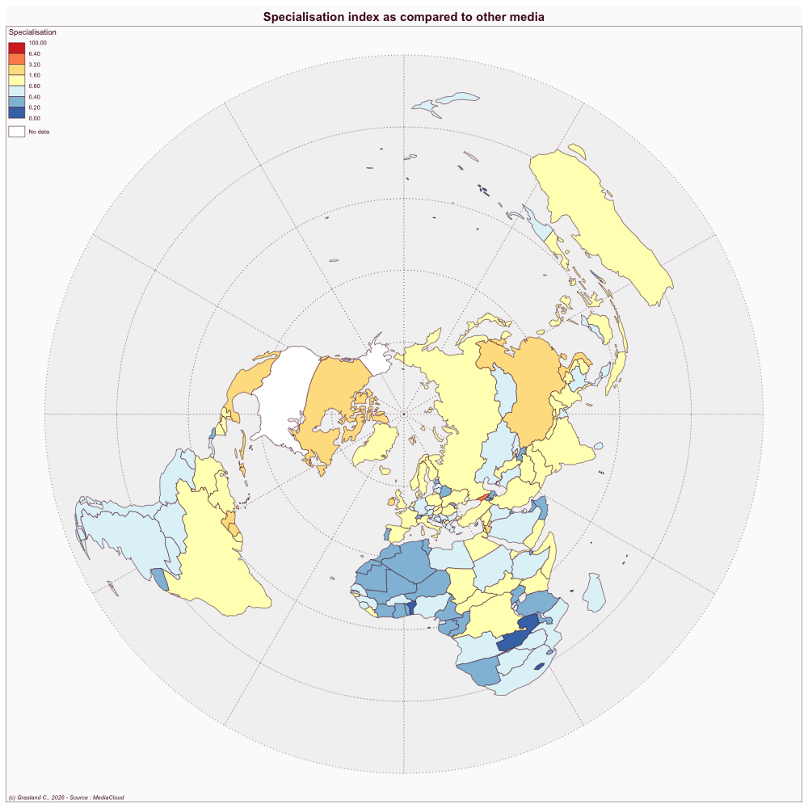

:::{#hero-heading}


::: {#profil}


::: {#pays}
## <i class="bi bi-globe2"></i> \
:::
:::

## <i class="bi bi-ui-checks-grid"></i> Website

- Link: [https://www.nytimes.com/](https://www.nytimes.com/)

## <i class="bi bi-file-earmark-text"></i> Publications

::: {#refs}
:::

:::

```{r, eval=F, echo=F}

### Compute results of interest
library(data.table)
library(dplyr)
library(sf)
library(cartogram)
library(mapsf)
library(RColorBrewer)
library(tidyr)
media<-"USA_nytime"
hc<-readRDS(paste0("../sirius/",media,"/hc_int.RDS")) %>%  filter(where1 !=substr(media,1,3))
nbnews<-sum(hc$news)
tab<-hc[,.(nb=sum(news)),.(ISO3=where1)] %>% 
         arrange(-nb) %>% 
        mutate(sal = 100*nb/nbnews)
map<-readRDS("../geom/world_riate.RDS")
grat<-st_read("../geom/grat30.geojson")
map<-st_transform(map,st_crs(grat))
wld<-left_join(map,tab)
wld2 <-wld %>% filter(is.na(sal)==F)

cart<-cartogram_dorling(x=wld2,weight="sal",k = 1)
png(paste0("img/",media,"_salience.png"),width = 1000, height=1000)
mf_map(grat, type="base", lty=3,col="lightblue")
mf_map(wld, type = "base",add=T, col="lightyellow", borde=NA)
mf_map(cart, type="base",col="red", add=T, border="white", lwd=0.4)
mf_label(cart, var = "ISO3",cex=2*sqrt(cart$sal/max(cart$sal)), col="white")
mf_layout("Most frequently mentionned countries",
          credits = "(c) Grasland C., 2026 - Source : MediaCloud",
          frame=T,
          arrow=F, 
          scale=F)
dev.off()


### Specialisation index
hctot<- readRDS("../data/hc.RDS") %>% 
      filter(where1 != substr(media,1,3), 
             where2 != substr(media,1,3))
hctot$sel <- as.factor(hctot$who==media)
levels(hctot$sel) <-c("No","Yes")

tab<-hctot[,.(nb=sum(news)),.(where1,sel)] %>% 
      pivot_wider(names_from = sel,values_from = nb, values_fill = 0)
tab <- tab %>% mutate(tot = Yes+No,
                     spec = (Yes/sum(Yes))/(tot/sum(tot)),
                     ISO3 = where1) %>%
               select(ISO3, spec)
wld <- left_join(map, tab)

png(paste0("img/",media,"_specialisation.png"),width = 1000, height=1000)
mypal<-rev(brewer.pal(name="RdYlBu",n = 7))
mf_map(grat, type="base", lty=3,col="gray95")
mf_map(wld, type = "choro",
       add=T,
       var="spec", breaks=c(0,0.2,0.4, 0.8, 1.6,3.2,6.4, 100),
       leg_title = "Specialisation",
       pal=mypal)

mf_layout("Specialisation index as compared to other media",
          credits = "(c) Grasland C., 2026 - Source : MediaCloud",
          frame=T,
          arrow=F, 
          scale=F)
dev.off()


#### NETWORK

source("pgm_network.R")


hc<-hc %>% filter(where1 !=substr(who,1,3),
                  where2 !=substr(who,1,3))

hc<-hc_filter(don = hc,
              wgt = "tags",
              where1 = "where1",
              where2 = "where2",
              where1_exc = c("_no_"),
              where2_exc = c("_no_"),
              self = FALSE
)

int <- build_int(don = hc,
                 s1=2,
                 s2=2,
                 n1=1,
                 n2=1,
                 k=0)
int$Fij<-round(int$Fij)

mod<-rand_int(int,
              resid = TRUE,
              diag = FALSE)

network<- geo_network(mod,
                      size = "Fij",
                      minsize = 5,
                      test = "Rchi_ij",
                      mintest = 3.84)
network
myfile<-paste0("networks/",media,"_network.html")
saveRDS(network, myfile)
q99<-quantile(mod$Fij,0.99)

network2<- geo_network(mod,
                      size = "Fij",
                      minsize = q99,
                      test = "Fij",
                      mintest = q99)
network2
myfile<-paste0("networks/",media,"_network2.html")
saveRDS(network2, myfile)

```


# SALIENCE ANALYSIS

## Top countries 

```{r, echo=F}
library(data.table,warn.conflicts = F, quietly = T)
library(dplyr,warn.conflicts = F, quietly = T)
library(knitr,warn.conflicts = F, quietly = T)
media<-"USA_nytime"
hc<-readRDS(paste0("../sirius/",media,"/hc_int.RDS")) %>%  filter(where1 !=substr(media,1,3))
nbnews<-sum(hc$news)
tab<-hc[,.(nb=round(sum(news))),.(ISO3=where1)] %>% 
         arrange(-nb) %>% 
        mutate(sal = 100*nb/nbnews,
               rnk = rank(-sal)) %>%
        select(rnk, ISO3,nb,sal)
kable(head(tab, 20),col.names = c("Rank","Country","weighted news", " % of news"), digits=c(0,0,0,1))
```

## Dorling cartogram




## Specialisation index



# NETWORK ANALYSIS

## Top dyads of countries

```{r, echo=F}
library(data.table,warn.conflicts = F, quietly = T)
library(dplyr,warn.conflicts = F, quietly = T)
library(knitr,warn.conflicts = F, quietly = T)
media<-"USA_nytime"
hc<-readRDS(paste0("../sirius/",media,"/hc_int.RDS")) %>%  filter(where1 !=substr(media,1,3))
nbnews<-sum(hc$news)
tab<-hc[,.(Fij=sum(news)*2),.(i=where1, j=where2)] %>% filter( i >j) %>%
         arrange(-Fij) %>%
        mutate(sal = 100*Fij/sum(Fij),
               rnk = rank(-sal)) %>%
        select(rnk, i,j,Fij,sal)
kable(head(tab, 20),col.names = c("Rank","Country1","Country2","weighted dyads", "% of dyads"), digits=c(0,0,0,1,1))
```


## Raw network

```{r, echo=F}
library(visNetwork)
media<-"USA_nytime"
myfile<-paste0("networks/",media,"_network2.html")
x<-readRDS(myfile)
x
```

## Preferential network

```{r, echo=F}
library(visNetwork)
media<-"USA_nytime"
myfile<-paste0("networks/",media,"_network.html")
x<-readRDS(myfile)
x
```

