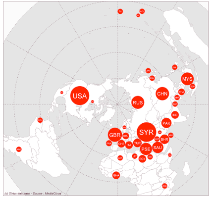

```{r}
library(readxl)
library(knitr)
library(dplyr)
library(tidytext)
library(data.table)
```

-   **Keywords**: international relations; media studies; world;
    geography; countries; spatial analysis; network analysis.

-   **Abstract**: Analysing the headlines and opening sentences of daily
    newspaper articles allows us to identify the list of foreign
    countries mentioned therein. This enables us to measure the flows
    between guest countries (those mentioned in the article) and host
    countries (where the newspaper is based). A sample of newspapers
    from different regions of the world thus forms a network of sensors
    that enables us to track, over time, the dynamics of the flows
    linking host countries and guest countries. This allows us, on the
    one hand, to analyse peaks of interest over time for certain guest
    countries. On the other hand, it enables us to compare how guest
    countries cover global news. The Sirius database, compiled using the
    open-access Mediacloud database, is one of the most diversified and
    equilibrated to date. It comprises 27 daily newspapers from 27
    countries across five continents and covers seven years, from 1 July
    2013 to 30 June 2020. All articles published by a newspaper were
    analysed using a dictionary to identify the countries mentioned in
    the language of publication (English, French, Spanish, Portuguese,
    Turkish, Persian, Indonesian, Russian, Arabic), and the country
    names were then converted into ISO 3 codes. We then randomly
    selected 100 international news articles per week for each
    newspaper. The database provides two types of files for each
    newspaper: (1) a list of geographically annotated articles; (2) an
    aggregated table showing the number of countries mentioned and
    country pairs, broken down by week of publication. A wide range of
    potential applications has been identified in both the social
    sciences (communication, geography, history, political science) and
    computer science (network analysis, signal theory).

## SPECIFICATION TABLES

::::: columns
::: {.column width="20%"}
**Subject**
:::

::: {.column .r-fit-text .smaller width="80%"}
Social Sciences
:::
:::::

::::: columns
::: {.column width="20%"}
**Specific field**
:::

::: {.column .r-fit-text .smaller width="80%"}
International news flows theory and geopolitics of the contemporary
world
:::
:::::

::::: columns
::: {.column width="20%"}
**Data type**
:::

::: {.column .r-fit-text .smaller width="80%"}
The database consists of 54 tables saved in the compressed format of the
statistical software R (.RDS), but which can be exported to .csv format
for use with other software. Each of the 27 newspapers is described by 2
tables:

\-**dt.RDS**: this file provides a sample of international news articles
(title and opening sentences) published by a newspaper, with a maximum
of 100 articles per week. It includes the date (when), the source (who),
the text of the article (what) and the foreign countries mentioned
(where) in the form of a list of ISO 3 codes

\-**hc.RDS**: this file provides an aggregation of the places cited in
the previous file in the form of a hypercube cross-referencing dates,
sources, places and pairs of places, described by the number of
corresponding articles in the form of raw frequency or fractions of
news.
:::
:::::

::::: columns
::: {.column width="20%"}
**Data collection**
:::

::: {.column .r-fit-text .smaller width="80%"}
The Mediacloud database provides access to news content published by a
large number of newspapers around the world. Normally, only the
headlines of news items can be obtained via the Mediacloud website.
However, in 2020, the database’s creator allowed us to analyse the
opening sentences as well, i.e. the news summaries that are usually
included in RSS feeds. Using various country dictionaries compiled by us
or by other researchers specialising in the analysis of international
news feeds, we were able to extract a list of the countries mentioned in
the headlines or descriptions of the news items.
:::
:::::

::::: columns
::: {.column width="20%"}
**Location of the data source**
:::

::: {.column .r-fit-text .smaller width="80%"}
Those interested in the primary source of our database (namely the news
headlines) will find it on the [MediaCloud project
website](https://search.mediacloud.org/). The specific objectives of the
Sirius project and a detailed presentation of the 27 newspapers selected
is available on the [website of the Sirius
project](https://worldregio.github.io/sirius/index.html).
:::
:::::

::::: columns
::: {.column width="20%"}
**Data accessibility**
:::

::: {.column .r-fit-text .smaller width="80%"}
A stable version of the database at the date of submission of the
article in Data in Brief has been released on the Harvard Dataverse

Repository name: Replication data for the Sirius project

Data identifier: <https://doi.org/10.7910/DVN/OP8XTZ>

Direct URL to the data: <https://doi.org/10.7910/DVN/OP8XTZ>

Furter development version will be made availale through the [github
repository of the Sirius project](https://worldregio.github.io/sirius/)
where it is possible to download the latest version of dictionnaries
used for countries recognition and some basic programs of exploration.
:::
:::::

::::: columns
::: {.column width="20%"}
**Related research article**
:::

::: {.column .r-fit-text .smaller width="80%"}
None at present. Various articles are in preparation.
:::
:::::

## VALUE OF THE DATA

-   **To support research in the field of communication and media
    studies concerning the International News Flow Theory (INFT)**. This
    field of research, established sixty years ago by @galtung1965 and
    @östgaard1965, proposes to analyse the patterns governing the
    coverage of foreign countries in the media. Initially limited to the
    analysis of a small sample of news items over short periods, this
    field of research has benefited from the exploration of a broader
    set of newspapers, in particular by Wu
    (@wu1998,@wu2000,@wu2003,@wu2007) and later Segev (@segev2010,
    @segev2014, @segev2016, @segev2017) . Unlike large databases such as
    GDELT, which are compilations of heterogeneous sources, the Sirius
    project offers a sample of news selected by journalists and
    published by quality newspapers. The 27 media have been carefully
    sampled on a geographical basis in order to provide an accurate
    picture of the diversity of perspectives all around the World.

-   **To suppor research in geopolitics and political science on the
    regionalisation of the world through information flows**. Media
    interest in events varies by newspaper location and is certainly not
    universal according to @hafez2007. Newspapers located in the same
    country generally share a similar geopolitical agenda. But the
    Sirius database offers an opportunity to explore similarities among
    media outlets in 27 countries worldwide. The Sirius database, for
    example, allows us to analyse whether coverage of foreign news
    differs between countries in the North and those in the South, or
    whether it is organised by region, language or culture.

-   **To provide a testing ground for analysing the dynamics of complex
    networks across space and time**. Indeed, the news items have been
    carefully sampled (100 international news articles per media outlet
    per week). The Sirius database can be easily used for empirical and
    theoretical experiments in statistical network analysis through two
    complementary approaches. Direct links between host countries (where
    the media outlet is based) and guest countries (mentioned in the
    news items). Indirect links between two guest countries are
    mentioned in the same news item by a host country acting as a third
    party.

## CONTEXT

The creation of global databases describing the dissemination of foreign
news initially drew on a selection of major newspapers, generally based
in Western countries, with a particular focus on English-language media
such as The New York Times and The Guardian\*, to which other media
outlets from Western were subsequently added, such as Le Monde, El País,
Die Zeit and The Asahi Shimbun… Due to the predominance of the same news
providers (Reuters, AP, AFP), these corpora suggested the existence of a
global public opinion. But research in the field of international news
flow theory has demonstrated that these hypothesis of media
globalisation is a myth [@hafez2007] and that the international agenda
remains strongly influenced by historical legacy, language barriers and
geographical distance [@grasland2019].

Currently, many researchers have attempted to overcome this problem by
exploring increasingly large databases collected from the internet and
by combining data from a wide range of sources (online media, social
media, etc.), thereby producing vast collections such as Google News or
the GDELT event database . But as Hong et al. [@hong2025] have pointed
out, these gigantic databases suffer from a high level of redundancy and
favour the views of the largest producers, introducing a sampling bias
in global geographical coverage and an obvious bias in favour of the
North over the South. The Sirius database, on the other hand, proposes
selecting a limited number of high-quality newspapers, enriched within a
national context, that more accurately reflect their readers' interests.

## DESCRIPTION OF THE DATA

The Sirius database is based on a selection of 27 newspapers located in
the world’s most powerful countries (18 of the 19 G20 member states),
supplemented by other countries where newspapers of sufficient quality
were available to cover the various UN regions as equitably as possible
(see Table 1 and Figure 1 ).

```{r}
library(readxl)
x<- read_xlsx("data/DESCRIPTION OF THE DATA.xlsx")
kable(x,caption = "Table1: list of media contained in the Sirius Database",
      digits=c(0,0,0,0,0,0,2))
```

{width="600"}

The data comes from two special extracts from the MediaCloud database
@roberts2021 , provided to the author in January and July 2020 by the
data manager, for the purpose of analysing the impact of the Covid
crisis on global public opinion. This very large dataset was based on
the raw extraction of XML from RSS feeds produced by newspapers and
harvested from the newspapers' websites. It was therefore not subject to
copyright, unlike data extracted from private websites such as Dow Jones
Factiva or LexisNexis. The content of RSS feeds was of particular
interest as it included not only the article title but also a
description field, generally comprising the first few sentences of the
article body. We selected from the 200 newspapers received according to
the following criteria:

-   The media outlet plays a major role in its country in covering
    international affairs.
-   The media outlet is a recognised newspaper analysed by communication
    studies researchers and has been the subject of research
    publications.
-   The amount of RSS feeds sent by the media is sufficient to collect a
    sample of 100 foreign news articles per week.
-   The RSS feeds have been collected by Media Cloud from July 2013 to
    31 December 2019 without any major interruptions in data collection.

Based on these criteria, we selected 27 newspapers from the collections
received in January and July 2020 that met the objective, even though
some did not achieve the 100% coverage target for foreign news during
the 350 weeks of the analysis period (Figure 2). This was in particular
the case for the media received in January 2020, but not updated in July
2020.

{width="600"}

The resulting database is organised into 27 folders, each named after
the newspaper code (e.g., FRA_lmonde). In each folder, the user will
find two files in compressed R format (.RDS), which are easy to convert
into text files (.csv).

### Table of international news items annotated by country (**dt_int.RDS**)

This file is a table containing international news items from the
newspapers, along with their source (who), publication date (when), a
concatenation of the headline and the first few sentences used (text),
the number of tokens (nbt), the list of foreign countries identified
(states) and the length of this list (nbstates). The structure is
illustrated by four examples of news items published in journal with
different languages in Table 2.

```{r}
n1 <- readRDS("sirius/JPN_asahis/dt_int.RDS") %>% filter(states=="CHN THA MYS USA")
n2 <- readRDS("sirius/RUS_nezgaz/dt_int.RDS") %>% filter(states=="BEL TUR UKR GEO KOS")
n2$text <-substr(n2$text,1,80)
n3  <- readRDS("sirius/EGY_alwafd/dt_int.RDS") %>% filter(states=="SAU RUS QAT VEN IRN")
n4 <- readRDS("sirius/NGA_vangua/dt_int.RDS") %>% filter(states =="GHA SEN CIV CMR KEN")
n<-rbind(n1,n2,n3,n4) %>% select(when, who, text, states)
kable(n, caption = "Table 2 : example of news annotated by ISO3 code of countries mentionned in title and description")

```

The reader is probably unable to understand the text in all languages
without the help of a translation. But the list of states mentionned in
ISO3 code make possible to compare the geographical coverage of foreign
news even if we ignore the exact content. The column states can be
therefore considerd as a form of universal geographical Esperanto ... In
the examples chosen,it is clear that the coverage is strongly related to
the regional location of the media.

### Hypercube of salience and links between the states mentioned in foreign news (**hc_int.RDS**)

This second file removes the text and focuses on the associations
between countries mentioned in the same news items. The first column
(*who*) indicates the newspaper, and the second column (*when*)
indicates the first day of the week on which the data was collected. The
columns *where1* and *where2* indicate the ISO3 code of the country pair
mentioned in the news. The tags column indicates the absolute number of
occurrences of countries or pairs, and the news column indicates the
corresponding weight as a fraction of news (*see above for a detailed
explanation*).

```{r}
hc <-readRDS("sirius/IDN_republ/hc_int.RDS")  %>%
         filter(when == as.Date("2018-04-09"),
                where1 %in% c("RUS", "SYR","USA"),
                where2 %in% c("RUS", "SYR","USA")) %>%
          arrange(where1,where2)
kable(hc, digits=c(0,0,0,0,0,2), caption = "Table 3: Extract from and hypercube describing the salience and links between foreign states")
```

The example presented in Table 3 is an extract from the hypercube of the
Indonesian newspaper *Republika* for the week beginning Monday, 9th
April 2018, which marked a turning point in the Syrian civil war. The
United States, France and the United Kingdom carried out a series of
military strikes involving aircraft and missiles launched from ships
against several government sites in Syria. These strikes were in
response to the chemical attack on civilians in Douma on 7 April, widely
attributed to the Syrian government. Russia protested at the UN, and
there was a risk of conflict with the Russian navy stationed at the port
of Tartus. The column tags indicate that out of 100 articles collected,
22 mentioned Syria, 17 the United States and 9 Russia. Concerning the
dyads, 7 articles mentioned both the United States and Syria, 5
mentioned Russia and Syria, and 2 mentioned the United States and
Russia. The column weights propose a different measure of salience, in
which the importance of a country is proportional to the fact that it is
mentioned alone and reduced when associated with other countries (*see.
supra*). It indicates a higher weight for the United States (10.26) than
for Syria (8.65), as Syria was more frequently associated with other
countries in dyads or triads than the United States, which was mentioned
alone in many articles.

Using only the where1 column, we can easily aggregate the hypercube to
produce maps of the most frequently mentioned foreign countries. But
using jointly both the where1 and where2 columns we can produce a
weighted network of foreign countries associated in the same news.
Figure 3 provides a visualisation example for the Indonesian newspaper
Republika for the week of 9–15 April 2018 of the country that was the
most mentioned (left) or the most linked to others (right)

*Figure 3 : Example of visualisation of hypercube data*

::::: columns
::: {.column width="45%"}
{width="250"}
:::

::: {.column width="45%"}
{width="250"}
:::
:::::

We do not comment on this result as it is not the purpose of a data
article. Still, the reader can easily imagine the potential applications
of this approach for a comparative analysis of the geopolitical agendas
of media outlets located across the globe across space and time.

## EXPERIMENTAL DESIGN. MATERIALS AND METHODS

The Sirius database was developed using a set of programmes written in
the R language, utilising various packages, notably quanteda for text
analysis and data. A table for handling the aggregation of large
datasets. The various steps are presented in.

{width="700"}

### Step 1: Importing and cleaning the text data

The data provided by MediaCloud in 2020 had been extracted from the XML
code of RSS feeds. It primarily includes the name of the media outlet
responsible for the publication (who), the publication date (when) and
two text fields relating to the article title and what is known as the
description, which is in fact a brief extract from the body of the RSS
flow of the article, usually the first few sentences, but sometimes
supplemented by HTML links to images or other articles. It is therefore
generally necessary to clean the description using regular expressions,
taking into account the specific characteristics of each media outlet.
We create a text field which is tthattion of thees and the description.
Next, we remove text containing fewer than 10 tokens and limit the
remaining text to a maximum of 100 tokens. This standardisation
procedure is necessary to ensure comparable data for subsequent
analysis. In practice, this limit of 100 tokens corresponds to what is
generally visible on a website, i.e. the news headline and one or two
lines of description.

More specific cleaning operations are also required, depending on the
language and the media outlet. For example, in the case of the Nigerian
newspaper La Vanguardia, many news items concern the Nigerian city known
as ‘Benin City’ or the Nigerian region of the ‘Niger Delta’. To avoid
incorrectly attributing these news items to the countries Benin (BEN)
and Niger (NER), we create the compounds ‘Benin_city’ and ‘Niger_delta’.
We cannot go into detail about all these cleaning steps. Still, it is
worth mentioning that they are particularly necessary in the case of the
United States of America, which is referred to by a large number of
abbreviations in each language (e.g. EE UU, EE. UU., E. U., EU, … in
Spanish).

### Steps 2 and 3: Identification of foreign news

For each language used in the newspapers, we have compiled a specific
dictionary to identify the countries mentioned. In most cases, we
compiled our dictionary using the newsmap package developed by Kohei
Watanabe and other contributors, available on GitHubrepository .
However, we decided to retain only country names and their grammatical
variants, and to exclude demonyms or capital cities, as the aim of the
Sirius database is not to recognise countries as geographical locations
or political actors (an essential approach), but to recognise them
solely as quasi-universal names that can be found in all languages and
be associated to an ISO-3 code which plays the role of Rosetta stone.
The aim of the Sirius database is indeed to analyse language games
\[14\], defined as variations in the use and meaning of countries’ names
in different contexts or different languages. This approach, based on
Wittgenstein’s theory of language\[15\], \[16\] , rests on a strong
assumption that the name of every country in the world exists in every
language and can be converted into an ISO-3 code that will act as a sort
of universal Esperanto.

The first obvious problem with this hypothesis is that there is no
consensus on a list of ‘countries’. We could certainly start with the
list of United Nations member states, as was done by Newsmap, but it is
difficult to exclude semi-autonomous or disputed territories as long as
they clearly play the same role as official states in current affairs.
For example, we decided to include Hong Kong (HKG) and Macao (MAC) as
recognised entities, since journalists treated them in the same way as
states. However, we decided not to include Wales, Scotland, Northern
Ireland and England, and to leave only the United Kingdom in the
dictionary. We have included Greenland and Western Sahara in the
dictionary because they cover vast areas where many events can take
place. We have decided to put Gaza and the West Bank in a single entity
associated with the Palestinian territories (PSE)… We acknowledge that
all these choices can be criticised and are open to debate, and we can
suggest that users of the Sirius database add or remove entities of
their choice when using it. In total, we have identified 220 entities
that are not necessarily ‘states’ in the legal sense, but which function
as actors or locations in discourse.

The second problem with the hypothesis of a universal translation of
state names is that it is difficult to limit translation to a single
name in each language. Firstly, many languages add a prefix or suffix to
the country’s name, which must be taken into account during recognition.
In Arabic, the coordinating conjunction ‘and’ is translated by the
letter wa (و), which is added to the following word as a prefix; thus, a
news item beginning with ‘Egypt, Algeria and Tunisia’ would become ‘مصر
وتونس والجزائر’. In German, country names may take a suffix when used in
the Saxon genitive case, and a news item beginning with “The citizens of
Belgium” might sometimes be translated as “Die Bürger von Belgien”, but
more frequently as “Die Bürger Belgiens” with a suffix. In such cases,
one might attempt to introduce a regular expression based on the root of
the words (e.g. Belgien\* or Belg\*). Still, we have limited their use
because it introduces a significant risk of false positives in the
results.

The third issue concerns the political dimension of the choice of a
country's name, which we wanted to avoid with our nominalist approach
but is, in fact, difficult to eliminate. For example, the name
associated with the state of ‘Israel’ (ISR) can be translated into
Persian as ‘اسرائیل’, but in most cases, the Iranian newspaper Hamshari
prefers to use ‘نظام صهيونيستي’, which can be translated into English as
‘the Zionist regime’. Another difficulty concerns words associated with
two geographical entities, such as the Arabic word المغرب, which can
refer to either the state of Morocco (MAR) or the North African region
known as the Maghreb. In this case, it is difficult to resolve the
ambiguity without taking context into account.

The reader will probably suggest solving the problem by using AI or
sophisticated linguistic models. However, these tools are difficult to
apply to short text extracts (fewer than 100 tokens) and incur high
computational costs for only a minor improvement in results. Another
solution could be to translate all the news into English as the pivot
language and use a single dictionary. But this solution also has an
important ecological cost and destroys a large part of the initial
information available in the native language, increasing the risk of
errors. Here, we prefer to use a simpler gazetter method, with low
computational cost and an acceptable error rate, as we shall see in step
7.

### Steps 4–5: Sampling 100 foreign news items per week

After identifying foreign news items with a limited risk of error (see
step 7), we carry out a random sampling of 100 news items per week. The
choice of a weekly sample is justified by the fact that all newspapers
are characterised by a reduced production cycle at the weekend, with a
minimum generally occurring on Saturdays and Sundays, but sometimes also
on Fridays for religious reasons\[17\]. It may also be the case that
certain newspapers specialise their content by day of the week and wait
a few days before covering an event.

The main reason for this limitation to 100 articles per week and 36,500
for the entire observation period is to give equal weight to the
different media outlets in the sample. The New York Times, for example,
produced 1.8 million articles over this period, compared with 0.3
million for smaller newspapers. However, from a geographical and
equitable sampling perspective, we wish to give equal weight to each in
our sample, without introducing a complex weighting procedure at a later
stage. And once again, we believe that high-quality research can be
achieved with small, carefully selected samples rather than with a
gigantic and heterogeneous database such as GDEL. And we must not forget
the environmental cost of unnecessary use of computing time!

### Step 6: Construction of hypercubes by media, week and pairs of foreign states

Transforming the list of states into a hypercube is easily achieved
using a data expansion and aggregation procedure in R. To illustrate the
method, we take the example of three articles on the Syrian crisis
published during the week of 9th April 2018 by the Indonesian newspaper
Republika. Three foreign articles were selected, corresponding to a
singleton, a dyad, and a triad (Table 4)

```{r}
dt <-readRDS("sirius/IDN_republ/dt_int.RDS")  %>%
         filter(week == "2018-04-09") %>% mutate (id = 1:100) %>%
         filter(id %in% c(24,40,96))

dt$text<-gsub("REPUBLIKA.CO.ID","", dt$text)
dt$text<-gsub("&nbsp","", dt$text)
dt <- dt %>% select(id,when=week,who, text, states) %>% mutate(id = 1:3)
kable(dt, caption="Table 4 : construction of hypercube : initial data")
```

We expand the dataset by the dimensions ‘when’ (week) and ‘who’ (media),
as well as ‘where 1’ and ‘where 2’, corresponding to the list of states
mentioned. We obtain an expanded table in which each news item is
transformed into $n^2$ rows, where $n$ is the number of foreign states
and ($1/n^2$) is the weight of the dyads based on the number of news
items (Table 5).

```{r}


  
  df<-data.table(id     = dt$id,
                 who    = dt$who,
                 when   = dt$when,
                 where1 = dt$states,
                 where2 = dt$states)

 

# unnest where1
  df<-unnest_tokens(df,where1,where1,to_lower=F,)
  
# unnest where2
  df<-unnest_tokens(df,where2,where2,to_lower=F) 

df <- unique(df)

# Compute weight of news
  newswgt<-df[,list(wgt=1/.N),list(id)]
  df <- merge(df,newswgt, by="id") 
  
kable(df, digits=c(0,0,0,0,0,2), caption = "Construction of the hypercube – expansion table")
```

We can then proceed to aggregate the news items and create two columns,
one relating to the sum of the weights, the other to the number of tags
(Table 6)

```{r}
  hc<- df[,.(tags = .N, news=sum(wgt)) ,.(who, when,where1,where2)]
  kable(hc, digits=c(0,0,0,0,1,2), caption = "Table 5: Construction of the hypercube – final result")
```

In our example, the reduction is not obvious, but it should be borne in
mind that we have collected a random sample of 100 news items per week,
many of which concern the same pairs of countries. Creating a hypercube
will therefore significantly reduce the computational cost of in-depth
analysis of country relevance or of network construction.

### Step 7: Estimating the accuracy and recall of foreign country recognition

For each of the 27 media outlets, we extracted a random sample of 100
news items containing two foreign countries from the dt_int.RDS table a
random sample of 100 news items containing two foreign countries, and we
manually checked the number of false positives (countries identified in
error) and false negatives (countries that should have been identified
but were not) to assess the precision and recall of the annotation
procedure’s results (Table 6).

```{r}
library(readxl)
x<- read_xlsx("data/tab3-precision-recall-VF.xlsx")
x[28,2]=""
kable(x,caption = "Table 6: Quality of foreign state identification in the 27 media of the Sirius database",
      digits=c(0,0,0,0,0,0,3,3,3))
```

**Accuracy rate**, defined as the percentage of correctly identified
foreign countries divided by the total number of foreign countries
identified, is 0.984, meaning that only 1.16% of tags are false
positives. For example, when the first name ‘Jordan’ is associated with
the country tag JOR in English-language news. Or when the Arabic term
المغرب (Maghrib) is used to refer to the country Morocco (MAR), even
though it is in fact associated with the whole of the North African
region.

**Recall rate**, defined as the percentage of foreign countries
correctly identified divided by the number of foreign countries actually
present in the news, is 0.970, meaning we have 1.3% false negatives,
i.e. countries that were present but were not identified. This is
generally the case when the country is associated with its head of state
(*Trump, Putin, Merkel, etc.*), its capital (*Paris, Washington, Moscow,
etc.*) or another symbolic location (*the White House, the Kremlin,
etc.*). This rate is relatively low because, in our analysis, we used
not only the headline but also the first few sentences of the body text.
In many cases, the journalist uses a metaphorical term in the article’s
headline but specifies the countries' names in the first paragraph.

**F-score** measures the overall quality of the annotation as the
harmonic mean of precision and recall; it is 0.977, with a minimum of
0.954 for the Algerian newspaper Al-Nahar and a maximum of 0.992 for the
Italian newspaper La Repubblica. These variations in quality appear
relatively small and consistent.

It is important to note here that the manual verification of 2,700 news
items and 5,400 countries was a lengthy but highly useful process that
helped us correct numerous errors in the dictionaries and identify
specific issues in the newspapers, such as the diversity of US
abbreviations and the ambiguity of certain geographical names, such as
‘*Benin*’ and ‘*Niger*’ in Nigeria. The dictionaries made available on
request by the author must not be used without a thorough examination of
the text’s content and an ex ante cleaning procedure, followed by ex
post quality control.

## LIMITATIONS

The Sirius database provides relatively good global coverage in terms of
distribution across the various UN regions, with five media outlets in
the Americas, five in Africa, five in Western Europe, five in Eastern
Europe and the Middle East, and seven in Asia and Oceania, as shown in
Figure 1. The balance between countries located in what is generally
defined as the ‘Global North’ and the ‘Global South’ is maintained, with
11 countries clearly belonging to the West, 5 to the BRICS and 11 to
what was historically defined as the Third World.

However, some important countries are missing, such as South Korea, for
which data collection only began in 2018. The same problem arises for
China, for which we have used the South China Morning Post, which is
actually based in Hong Kong. Another issue concerns Africa, where the
major countries in terms of economy and population are covered (Egypt,
Algeria, Nigeria, Kenya, South Africa), but where smaller countries are
overlooked, particularly the French-speaking countries of West Africa.
This is a significant caveat, as the international agendas of French-
and English-language media in Africa differ [@grasland2026] .

## ETHICAL STATEMENT

The author has read and complies with the ethical requirements for
publication in Data in Brief and confirms that this work does not
involve human subjects, animal experiments or data collected from social
media platforms.

## AUTHOR’S CRediT STATEMENT

Not applicable: sole author who carried out all the work presented in
the article.

## ACKNOWLEDGEMENTS

This research did not receive any specific funding from public,
commercial or non-profit funding bodies. We want to thank the members of
the MediaCloud team for providing us with a special extract from their
RSS feed database, containing news headlines and descriptions from
January and July 2020. This open database, which has recently been
updated, can still be used to supplement and expand upon this research
[@roberts2021]. We would also like to thank Kohei Watanabe, the author and
coordinator of Newsmap, who provided an initial dictionary for
identifying the states mentioned in the news [@watanabe2018]. We would
also like to thank Kenneth Benoit, who developed the R package quanteda
for text analysis in political science [@benoit2018].

## DECLARATION OF CONFLICTS OF INTEREST

• The authors declare that they have no known financial conflicts of
interest or personal relationships that could influence the work
presented in this article.

• The authors declare the following financial interests/personal
relationships, which could be considered potential conflicts of
interest:
